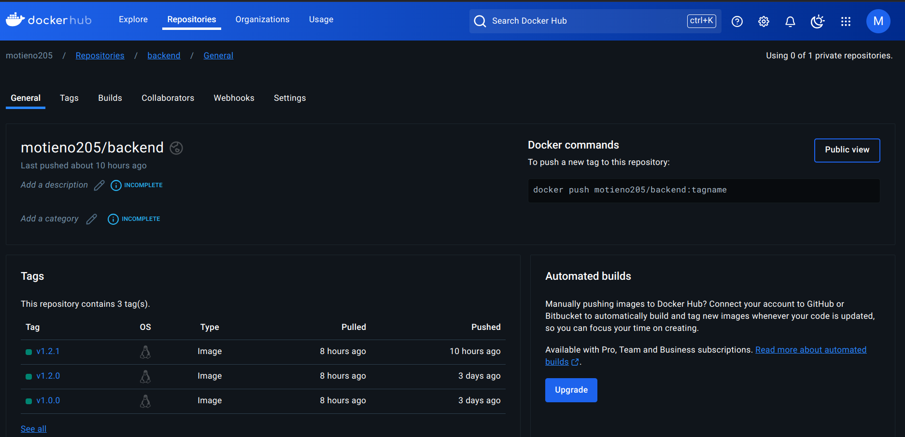

# Overview
This project involved the containerization and deployment of a full-stack yolo application using Docker.

# Requirements
Install the docker engine here:
- [Docker](https://docs.docker.com/engine/install/) 

## How to launch the application 
#### 2. Frontend

#### 2. Backend

## How to run the app
Use vagrant up --provison command
